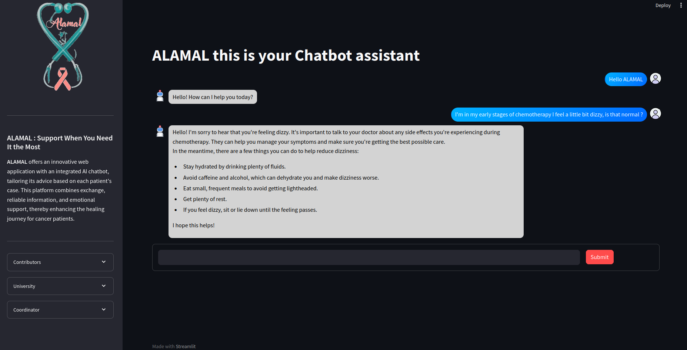
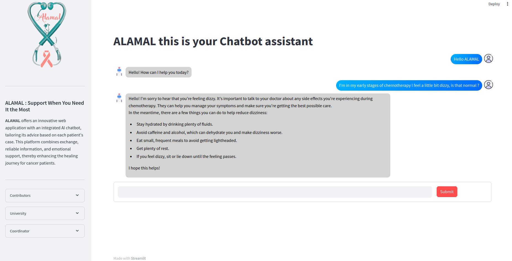

# ALAMAL CHATBOT
> 
Check out the demo
> <a href='https://alamal-chatbot.streamlit.app/'> ALAMAL </a>
> 

    
    

---
# Introduction

**ALAMAL** "**الأمل** " is a collaborative web app developed with master's degree students specializing in '*MANAGEMENT DE L’INNOVATION ET DE LA TECHNOLOGIE*' from ENSAM-RABAT. The project incorporates a chatbot powered by a Large Language Model (LLM) based on PaLM , with a primary focus on providing valuable support to cancer patients during the early stages of therapy and chemotherapy.

Designed for easy access and free use, **ALAMAL** offers a demo for exploration. The project is open source, utilizing the MIT license for transparency and collaboration. Your interest and potential contributions are welcomed. Feel free to delve into the repository for project details and consider contributing to the ongoing development of **ALAMAL**.